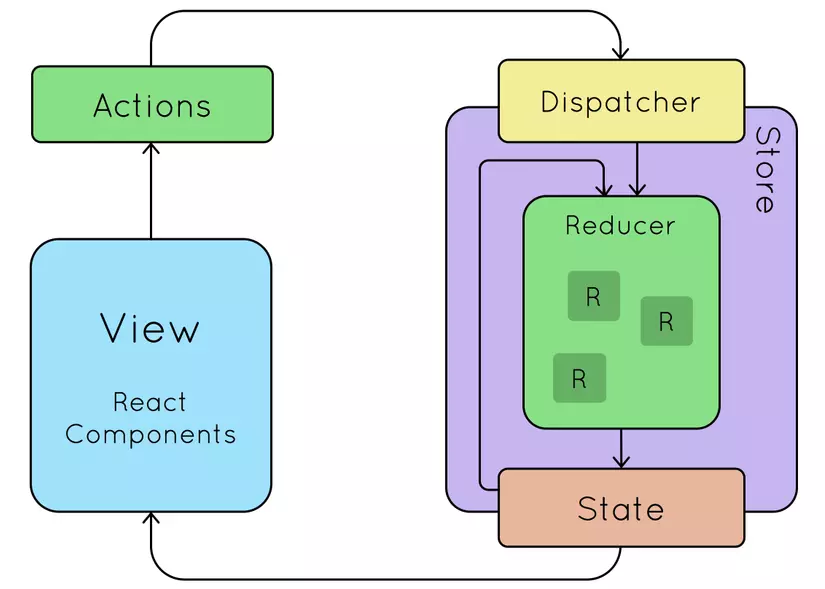

# REDUX-TOOLKIT (RTK)

-  `Redux toolkit` là 1 thư viện giúp mình viết `redux` tốt hơn ngắn gọn hơn



## Redux toolkit gồm:

### redux-toolkit: configureStore

-  `configureStore` dùng để khởi tạo store
-  `configureStore` sẽ mặc định sử dụng `redux devtool` để `debug` theo dõi quá trình cập nhật của state

VD:

```
import { configureStore } from '@reduxjs/toolkit';

const store = configureStore({
  reducer: rootReducer
})

```

### redux-toolkit: `createAction`

-  Tạo ra 1 action với hàm `createAction`

VD:

```
import { createAction } from '@reduxjs/toolkit';

const increment = createAction('INCREMENT')

console.log(incrementNew())
```

### redux-toolkit: `createReducer`

-  `createReducer` giúp chúng ta không phải tạo reducer bằng js thuần nữa
-  `createReducer` cho phép khởi tạo `reducer` một cách đơn giản

VD:

```
import {createReducer} from '@reduxjs/toolkit'

const increment = createAction('INCREMENT')
const decrement = createAction('DECREMENT')

const initialState = { count: 0 }

// Tham số thứ nhất là initState

const counter = createReducer({ count: 0 }, {
  [increment.type]: state => ({ count: state.count + 1 }),
  [decrement.type]: state => ({ count: state.count - 1 })
}

```

### redux-toolkit: `createSlice`

-  Không còn phải tạo riêng các file `action`,`reducer`,`type`
-  action types tự động sinh ra kèm tiền tố mặc định là trường name
-  `createSlice` giúp chúng ta viết ngắn gọn hơn khi quản lý `state`
-  `createSlice` mutate trực tiếp

VD:

```
import { createSlice } from '@reduxjs/toolkit';

const counterSlice = createSlice({
  name: 'counter',
  initialState: { count: 0 },
  reducers: {
    increment: state => state.count += 1,
    decrement: state => state.count -= 1
  }
})

export const { increment, decrement } = counterSlice.actions
export default counterSlice.reducer

```

### Phân biệt `createSlice` và `createReducer`

-  `createReducer`, kiểm soát dễ hơn đối với names/types `createAction` có thể viết hoa tên action
-  `createSlice` action types tự sinh tiền tố mặc đinh là field name và `createSlice` sẽ viết ít dài dòng hơn `createReducer`

VD:

```
// sử dụng createReducer

const login = createAction('auth/LOGIN')
const register = createAction('auth/REGISTER')

const counter = createReducer({ count: 0 }, {
  [login]: () => {},
  [register]: () => {}
}

// sử dụng createSlice

const authSlice = createSlice({
  name: 'auth',
  initialState: {},
  reducers: {
    login: () => {}
    register: () => {}
  }
})

```

-  VD trên, với `createReducer` dài hơn 1 chút so sánh lượng hàng. Ngoại thực tế sẽ bị lặp lại "auth/" ở đầu tên mỗi loại hành động

### redux `useSelector`

-  `useSelector` giúp chúng ta lấy `state` từ `store`

VD:

```
import { useSelector } from "react-redux";
function Component (){
    const newState = useSelector((state) => state.nameState);
}

```

### redux `useDispatch`

-  `useDispatch` tham chiếu đến `dispatch function` từ `redux store` và để dispatch các action.

VD:

```
import { useSelector, useDispatch } from "react-redux";
function Component (){
    const newState = useSelector((state) => state.nameState);
    const dispatch = useDispatch()

    const dispatchAddToCart = (product) => dispatch(increment());
}

```
